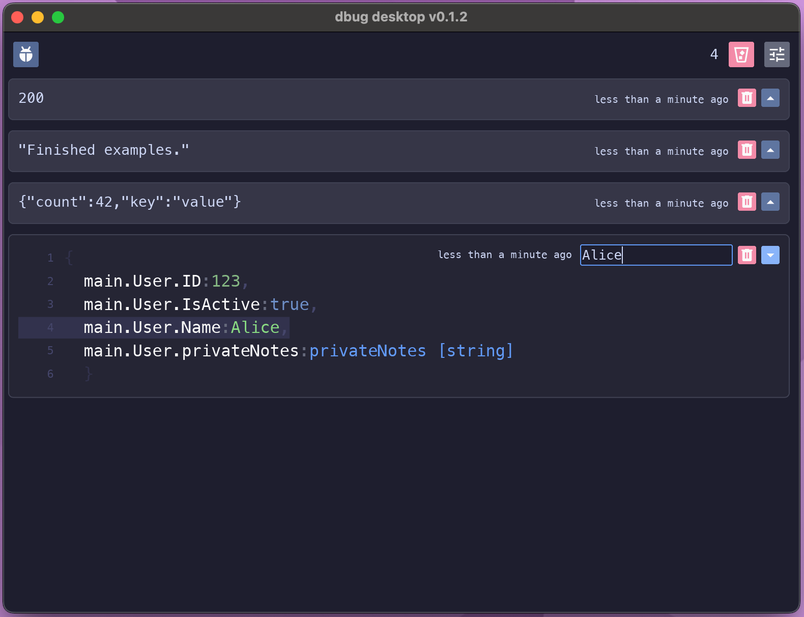

# Dbug Go Agent

[](https://github.com/dbugapp/dbug-go/actions/workflows/test.yml)
[](https://opensource.org/licenses/MIT)

Send data from your running Go application directly to the [Dbug desktop app](https://github.com/dbugapp/desktop) for live inspection. This package makes it trivial to visualize the state of your Go variables and data structures without interrupting your program.



---

## Features

- **Simple Interface:** Just call `dbug.Go()` with almost any Go variable, struct, map, slice, or other data type to see it in the Dbug app.
- **Variadic Sending:** Send multiple different variables in a single `dbug.Go()` call; each will appear separately.

---

## Installation

```bash
go get github.com/dbugapp/dbug-go
```

---

## Usage

https://github.com/dbugapp/dbug-go/blob/4f8ba69a063dcfb16d714609d34e916b16deb87d/examples/main.go#L1-L35

---

## License

This project is open-sourced under the [MIT license](https://opensource.org/licenses/MIT).

